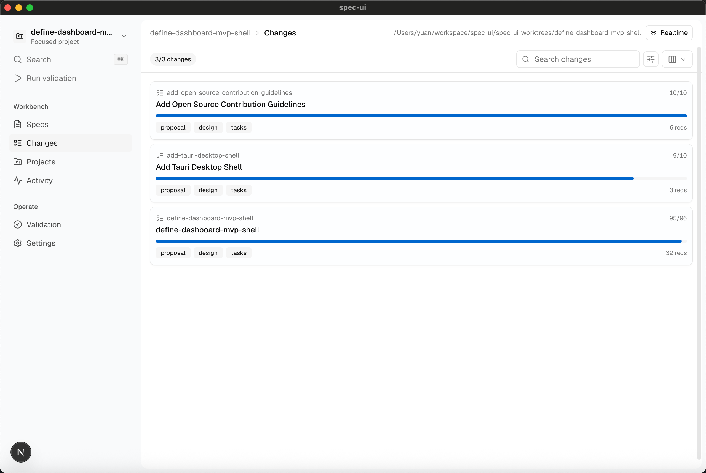
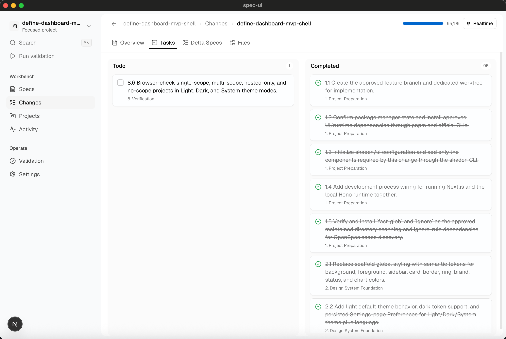

# spec-ui

spec-ui 是一个面向 spec-driven development 的本地看板。

它会把本地 OpenSpec 项目转换成实时工作区，用来查看 changes、specs、tasks、files 和 validation state。

**[English](./README.md) | 简体中文**

## spec-ui 是什么？

spec-driven 项目里的上下文通常分散在 changes、specs、tasks、deltas、validation output 等文件里。spec-ui 的目标是把这些本地项目结构变成一个更容易浏览、导航和审阅的产品界面。

spec-ui 不会替代 OpenSpec。它给本地 spec 文件提供一个可视化工作区，包含项目导航、进度视图和实时更新。

首批支持的工作流是 OpenSpec：

- 添加一个或多个本地项目目录。
- 自动识别 OpenSpec 工作区，包括 monorepo 里的嵌套 scope。
- 跟踪 changes、specs、task progress、files 和 validation state。
- 监听本地文件变化，并实时更新看板。
- 在全局项目视图和单项目聚焦视图之间切换，同时保留上下文。

后续版本计划支持更多 spec 格式。

## 界面预览

**Changes board**

<p align="center">
  
</p>

**Change tasks**

<p align="center">
  
</p>

## 当前状态

spec-ui 仍处于早期 preview 阶段。当前版本聚焦 OpenSpec 项目、多项目看板、monorepo scope 识别、本地实时更新，以及带集成终端的桌面端 preview。

稳定版发布前，部分 UI flow 和桌面端行为仍可能调整。

| 模块 | 状态 |
| --- | --- |
| Web dashboard | Preview |
| OpenSpec support | Available |
| Multi-project dashboard | Available |
| Monorepo scope detection | Available |
| Realtime local updates | Available |
| Desktop app with terminal | Preview |
| Additional spec dialects | Planned |

## 核心功能

- **Project dashboard**：在一个工作区里管理多个本地项目。
- **Change board**：查看 OpenSpec changes 的进度、scope、task、spec 和 file 上下文。
- **Spec board**：跨项目浏览 specs，也可以进入单个项目聚焦查看。
- **Monorepo scopes**：自动识别嵌套 `openspec` 目录，并把同一个 change ID 下的不同 scope 汇总到同一个项目里。
- **Realtime updates**：本地 runtime 监听文件变化，并通过 WebSocket 推送给 UI。
- **Local settings**：项目状态和偏好设置保存在本地 `~/.spec-ui/settings.json`。
- **Theme and language preferences**：支持 light、dark、system 主题。
- **Desktop terminal**：在当前聚焦项目目录里打开常驻终端，方便快速启动 `codex`、`claude` 以及其他本地 CLI。

## 使用流程

1. 本地启动 spec-ui。
2. 打开 **Projects**，添加一个本地项目目录。
3. spec-ui 会自动识别目录里的 OpenSpec 结构。
4. 打开 **Changes**，查看 active changes、tasks、scopes、deltas、specs 和 files。
5. 打开 **Specs**，浏览项目 specs。
6. 在桌面端里，从右下角打开终端，在当前聚焦项目目录中运行本地 CLI 工具。
7. 在 **Settings** 里调整主题和语言偏好。

对于 monorepo，只需要添加仓库根目录。spec-ui 会自动识别其中存在的嵌套 `openspec` scope，并只展示实际存在的 scope。

## 技术栈

| 层 | 技术 |
| --- | --- |
| Web app | Next.js, React, TypeScript |
| UI | shadcn/ui, Base UI primitives, Motion |
| Local runtime | Hono, WebSocket, file watcher |
| Spec planning | OpenSpec |
| Desktop shell | Tauri v2 |
| Package manager | pnpm |
| Tests | Vitest, TypeScript, ESLint |

## 架构

```text
┌────────────────────┐
│   Next.js Web UI   │
│ boards, settings,  │
│ project navigation │
└─────────┬──────────┘
          │ HTTP + WebSocket
┌─────────▼──────────┐
│   Local Runtime    │
│ Hono API, watcher, │
│ settings store     │
└─────────┬──────────┘
          │ local file access
┌─────────▼──────────┐
│  Project Folders   │
│ openspec changes,  │
│ specs, tasks, docs │
└────────────────────┘

┌────────────────────┐
│   Tauri Shell      │
│ desktop container  │
│ and terminal PTY   │
└────────────────────┘
```

Local runtime 负责本地文件访问、目录发现、settings 持久化和文件监听。React components 消费结构化后的项目数据，不直接读取文件系统。

桌面端通过 Tauri 和 Rust-managed PTY 管理集成终端会话。终端会话在 app 内切换路由时保持存活，新建终端会进入当前聚焦项目目录。

## 环境要求

- Node.js 22 或更新版本。
- pnpm 10 或更新版本。
- OpenSpec validation 需要 `PATH` 上可用的 OpenSpec CLI。
- Tauri 桌面开发需要 Rust stable toolchain。
- macOS 上进行 Tauri 开发需要 Xcode Command Line Tools。

## 从源码运行

```bash
pnpm install
pnpm dev
```

默认开发命令会同时启动 Next.js app 和 local runtime。

开发服务启动后，打开 http://localhost:3000。

## 桌面端开发

当前 Tauri shell 会在开发模式下加载本地 Web app。

桌面模式还提供集成终端，主要用于快速启动项目目录内的 CLI 工具，例如：

```bash
codex
claude
```

新建终端会话会使用当前聚焦项目目录作为 `cwd`。如果没有聚焦项目，则进入用户主目录。

```bash
source "$HOME/.cargo/env"
pnpm desktop:dev
```

## 桌面端 Release 产物

Release tag 使用 `vX.Y.Z`，从 `v0.0.1` 开始。Preview release artifacts 会构建 macOS、Windows 和 Linux 桌面端产物，并附加到 GitHub Releases。

初期 preview 产物包括：

- macOS Apple Silicon 和 Intel 的 DMG。
- Windows NSIS installer。
- Linux AppImage 和 Debian package。

桌面端 preview build 都不签名。代码签名、公证、自动更新、updater manifest、package-manager 发布和 app-store 发布都不属于初期 release flow。

macOS 可能会拦截未签名的 preview build。将 `spec-ui.app` 移动到 `/Applications` 后，只对你信任的 release 产物执行下面的命令：

```bash
xattr -dr com.apple.quarantine "/Applications/spec-ui.app"
```

Pull request 会自动运行 desktop compile workflow，覆盖 macOS、Windows 和 Linux targets。它会准备 desktop runtime 并检查 Tauri crate，但不会生成 installer artifacts。

本机打包当前 host：

```bash
source "$HOME/.cargo/env"
pnpm desktop:build --ci --no-sign
```

## 开发检查

```bash
pnpm typecheck
pnpm lint
pnpm test
pnpm spec:validate
```

涉及 Tauri 的改动：

```bash
source "$HOME/.cargo/env"
pnpm desktop:prepare-sidecar
cd src-tauri
cargo fmt --check
cargo check
```

## 贡献

提交 pull request 前请先阅读 [CONTRIBUTING.md](./CONTRIBUTING.md)。

## 许可证

Apache-2.0。见 [LICENSE](./LICENSE)。
